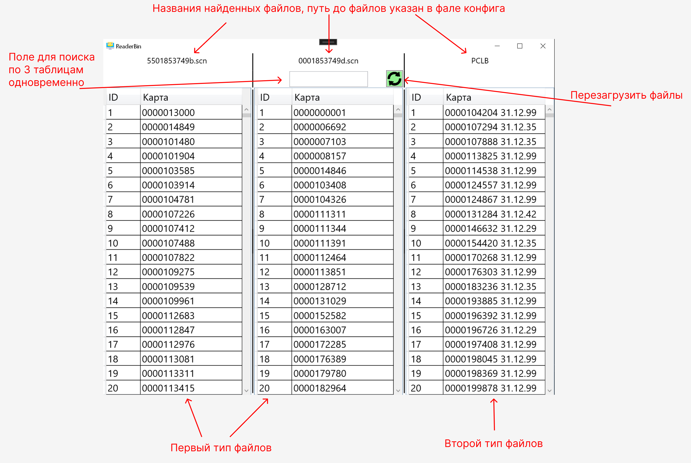

# Описание проекта

# ReaderBin 

## Данный проект предназначен для чтения бинарных файлов хранящих в себе данные зашифрованные по определенной формуле

### Типы файлов: 

- Каждые 4 байта содержат в себе один целостный номер, последние 8 байт остаточные и не несут полезной информации, формула для прочтения\n  '(256 * 256 * 256 * b1) + 256 * 256 * b2 + 256 * b3 + b4', где b1-4 номер прочитанного байта

- Первые 9 байт нужно откинуть так как не содержат полезной информации, файл содержит в себе 2 значения номер и дата, номер 4 байта, дата 3 байта. Номер расшифровывается как и в первом файле, дата читается по байтова соотвественно день,месяц,год(2 цифры)

Кусочек кода читающий второй тип файла
'''
BindingList<ListModel> list = new BindingList<ListModel>();

                FileStream myStream = new FileStream(pathToFile, FileMode.Open, FileAccess.Read);
                BinaryReader myReader = new BinaryReader(myStream);

                myReader.ReadBytes(9);

                string val = "";
                int sum = 0;
                int id = 0;
                int counter = 1;
                while (myReader.BaseStream.Position < myReader.BaseStream.Length)
                {
                    if (id % 2 == 0)
                    {
                        byte[] d = myReader.ReadBytes(4);
                        int a1 = Decimal.ToByte(d[0]);
                        int a2 = Decimal.ToByte(d[1]);
                        int a3 = Decimal.ToByte(d[2]);
                        int a4 = Decimal.ToByte(d[3]);
                        sum = ((256 * 256 * 256 * a1) + 256 * 256 * a2 + 256 * a3 + a4);
                        val = addNullToStartCardNumber(sum.ToString());
                    }else
                    {
                        byte[] d = myReader.ReadBytes(3);
                        int a1 = Decimal.ToByte(d[0]);
                        int a2 = Decimal.ToByte(d[1]);
                        int a3 = Decimal.ToByte(d[2]);
                        list.Add(new ListModel()
                        {
                            Id = counter.ToString(),
                            Card = val + " " + addNullToDate(a1.ToString()) + "." + addNullToDate(a2.ToString()) + "." + a3.ToString()
                        });
                        counter++;
                    }
                    sum = 0;
                    id++;
                }
'''
### Алгоритм работы
- Запуск программы 
- Проверка существования файлов рядом с .exe 1) config.cfg; 2) log.txt
- Файл не создан - создать и вывести ошибку о том что файл пуст
-   Файл создан - прочитать файл который содержит в себе путь до папки с файлами
- Прочитать 3 файла содеражище в названии 1) ...b.scn 2) ...d.scn 3) PCLB
- Условно в папке сожержатся всегда 1 файл каждого типа
-   Обработка ошибок и информирование пользователя в случае если:
- Файлов недостаточно
- Файл пуст
- Файл сожержит некоректную информацию (не удалось прочитать и распарсить)
- Файлов одного типа более 1-ого
- Файл не доступен для чтения
- Успешное чтение файла
- Парсинг по формулам описанными в пункте выше
- Вывод на экран информации в виде 3-ех таблиц

#### Примечания по алгоритму работы
- Дата дополняется до полного вида. Пример: 7.11.98 -> 07.11.98
- Номер дополняется до 10 цифр. Пример 1300 -> 0000001300

### Дополнительный функционал
- Логирование действий 
- Шаблон: [Дата Время] Текст
- Пример: [28.10.2022 14:53:15] Файлы загружены успешно: 1 - C:\Users\Dima\0001050709b.scn; 2 - C:\Users\Dima\6128353749d.scn; 3- C:\Users\Dima\PCLB
- Поиск по таблицам
- Перезагрузить файлы из папки (файлы обновляются несколько раз в час)
- Отоброжать время последней перезагрузки в заголовке окна

### Визуальный интерфейс

